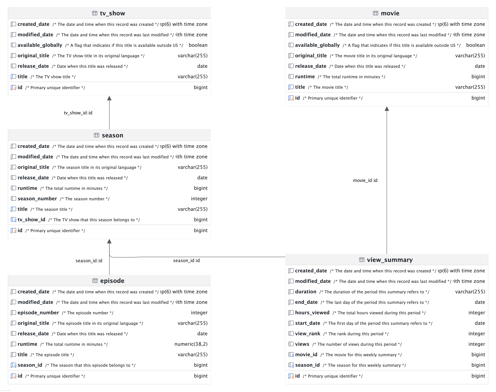

# Netflix Sample Database

Sample database based on the data from the [Netflix Engagement Report](https://about.netflix.com/en/news/what-we-watched-the-first-half-of-2024) and the [Netflix Global Top 10](https://www.netflix.com/tudum/top10) weekly list, it includes movies and TV shows for learning and practice purposes.

## Supported Database Servers

* MySQL
* Oracle
* PostgreSQL
* SQLite
* SQL Server

## Download
Download the SQL scripts from the [latest release](../../releases) assets. One or more SQL script files are provided for each database vendor supported. You can run these SQL scripts with your preferred database tool.

## Data Sources

* https://about.netflix.com/en/news/what-we-watched-the-first-half-of-2024
* https://about.netflix.com/en/news/what-we-watched-the-second-half-of-2023
* https://www.netflix.com/tudum/top10

## Data Model



## Sample Queries - Postgres

```sql
-- Movies released since 2024-01-01
select id, title, runtime from movie where release_date >= '2024-01-01';
```

```sql
-- TV Show Seasons released since 2024-01-01
select s.id, s.title as season_title, s.season_number, t.title as tv_show, s.runtime
from season s left join tv_show t on t.id = s.tv_show_id
where s.release_date >= '2024-01-01';
```

```sql
-- Top 10 movies (English)
select v.view_rank, m.title, v.hours_viewed, m.runtime, v.views, v.cumulative_weeks_in_top10
from view_summary v
inner join movie m on m.id = v.movie_id
where duration = 'WEEKLY'
  and start_date = '2024-12-09'
  and m.locale = 'en'
order by v.view_rank asc;
```

```sql
-- Engagement report
select m.title, m.original_title, m.available_globally, m.release_date, v.hours_viewed, m.runtime, v.views
from view_summary v
inner join movie m on m.id = v.movie_id
where duration = 'SEMI_ANNUALLY'
  and start_date = '2024-01-01'
order by v.view_rank asc;
```

## Development

* The application is a [Spring Boot](https://spring.io/projects/spring-boot) application that uses [Spring Data JPA](https://spring.io/projects/spring-data-jpa) / [Hibernate](https://hibernate.org/orm/) Object/Relational Mapping framework. 
* The database schema is defined in these [entity classes](src/main/kotlin/com/github/lerocha/netflixdb/entity), and it gets auto-generated when the application starts up.
* After start-up, the application uses [Spring Batch](https://spring.io/projects/spring-batch) to run a [batch job](src/main/kotlin/com/github/lerocha/netflixdb/batch/ImportNetflixDataJobConfig.kt) to populate the database based on the [Netflix spreadsheet reports](src/main/resources/reports), and then exports the database schema and data to a SQL script.

### System Requirements
* JDK 21, for example: [Amazon Corretto 21](https://docs.aws.amazon.com/corretto/latest/corretto-21-ug/downloads-list.html), [Oracle OpenJDK 21](https://www.oracle.com/java/technologies/downloads/#java21), [MS OpenJDK 21](https://learn.microsoft.com/en-us/java/openjdk/download#openjdk-2105-lts--see-previous-releases), etc.
* [Docker Desktop](https://www.docker.com/products/docker-desktop/)

### Building and generating the SQL Scripts

Start the database containers:
```bash
docker compose up -d
```

Generate the SQL Scripts:
```bash
./build.sh
```

The generated SQL scripts will be in the `build/artifacts` folder:
```bash
open ./build/artifacts
```
