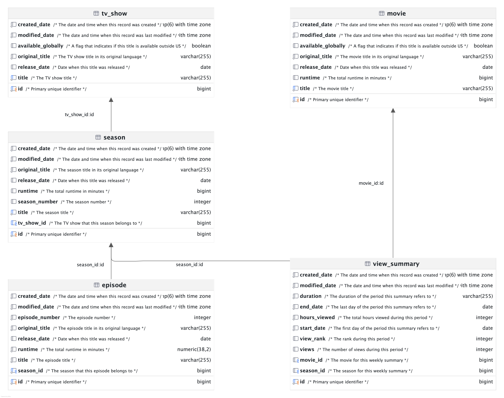

# Netflix Sample Database

Sample database based on data from the [Netflix Engagement Report](https://about.netflix.com/en/news/what-we-watched-the-first-half-of-2024), the [second-half 2023 report](https://about.netflix.com/en/news/what-we-watched-the-second-half-of-2023), and the [Netflix Global Top 10](https://www.netflix.com/tudum/top10) weekly list. It includes movies, TV shows (as seasons), and viewing metrics for learning and practice.

## Supported database servers

| Vendor     | Generated artifact (via `./build.sh`) |
|------------|----------------------------------------|
| PostgreSQL | `build/artifacts/netflixdb-postgres.sql` |
| MySQL      | `netflixdb-mysql.sql` |
| Oracle     | `netflixdb-oracle.sql` |
| SQL Server | `netflixdb-sqlserver.sql` |
| SQLite     | `netflixdb-sqlite.sql` |
| H2         | `netflixdb-h2.sql` |

Table and column names use Hibernate’s `CamelCaseToUnderscoresNamingStrategy` (e.g. `tv_show`, `view_summary`, `cumulative_weeks_in_top10`). The sample queries below target **PostgreSQL**; the same shapes work on other vendors with minor literal/type tweaks.

## Download

Download ready-made SQL scripts from the [latest release](../../releases) assets, or generate them locally (see [Building](#building-and-generating-sql-scripts)).

## Data sources

* [What We Watched — H1 2024](https://about.netflix.com/en/news/what-we-watched-the-first-half-of-2024) (semi-annual engagement)
* [What We Watched — H2 2023](https://about.netflix.com/en/news/what-we-watched-the-second-half-of-2023) (semi-annual engagement)
* [Netflix Global Top 10](https://www.netflix.com/tudum/top10) (`all-weeks-global.xlsx`, weekly rankings)

## Data model

Core tables populated by the batch job:

| Table | Role |
|-------|------|
| `movie` | Standalone films + engagement / top-10 metrics |
| `tv_show` | Series root (title, locale, availability) |
| `season` | TV “title” rows from reports (linked to `tv_show`) |
| `view_summary` | Hours viewed, views, rank, period (`WEEKLY` or `SEMI_ANNUALLY`) |
| `episode` | Schema present; not filled by the current import |



## Sample queries (PostgreSQL)

```sql
-- Movies released on or after 2024-01-01
SELECT id, title, runtime
FROM movie
WHERE release_date >= DATE '2024-01-01';
```

```sql
-- TV seasons released on or after 2024-01-01 (with series name)
SELECT s.id,
       s.title       AS season_title,
       s.season_number,
       t.title       AS tv_show,
       s.runtime
FROM season s
LEFT JOIN tv_show t ON t.id = s.tv_show_id
WHERE s.release_date >= DATE '2024-01-01';
```

```sql
-- Weekly top 10 movies (English locale)
SELECT v.view_rank,
       m.title,
       v.hours_viewed,
       m.runtime,
       v.views,
       v.cumulative_weeks_in_top10
FROM view_summary v
INNER JOIN movie m ON m.id = v.movie_id
WHERE v.duration = 'WEEKLY'
  AND v.end_date = DATE '2025-06-29'
  AND m.locale = 'en'
ORDER BY v.view_rank;
```

```sql
-- Semi-annual engagement report (movies, H1 2024 window)
SELECT m.title,
       m.original_title,
       m.available_globally,
       m.release_date,
       v.hours_viewed,
       m.runtime,
       v.views
FROM view_summary v
INNER JOIN movie m ON m.id = v.movie_id
WHERE v.duration = 'SEMI_ANNUALLY'
  AND v.start_date = DATE '2024-01-01'
ORDER BY v.view_rank NULLS LAST;
```

```sql
-- Weekly top TV (season-level rows with rank)
SELECT v.view_rank,
       t.title AS tv_show,
       s.title AS season_title,
       v.hours_viewed,
       v.views,
       v.end_date
FROM view_summary v
INNER JOIN season s ON s.id = v.season_id
INNER JOIN tv_show t ON t.id = s.tv_show_id
WHERE v.duration = 'WEEKLY'
ORDER BY v.end_date DESC, v.view_rank
LIMIT 20;
```

```sql
-- Load generated script into a local Postgres (after ./build.sh)
-- psql -U postgres -d netflixdb -f build/artifacts/netflixdb-postgres.sql
```

## Development

This repo is a [Spring Boot](https://spring.io/projects/spring-boot) app using [Spring Data JPA](https://spring.io/projects/spring-data-jpa) / [Hibernate](https://hibernate.org/orm/) for schema generation and [Spring Batch](https://spring.io/projects/spring-batch) for import and export.

### Pipeline (high level)

1. **Schema** — JPA entities under `entity/`; DDL is created when `spring.jpa.hibernate.ddlAuto=create`.
2. **Import** — `CreateNetflixDatabaseJobConfig` reads Excel reports from `src/main/resources/reports/`, stages rows by title/runtime, builds `Movie` / `Season` / `TvShow` / `ViewSummary`, and verifies weekly data.
3. **Export** — For non-SQLite profiles, appends dialect-specific `INSERT` statements and zips `build/artifacts/netflixdb-{profile}.sql`.

Key source locations:

| Area | Package / file |
|------|----------------|
| Batch job | `batch/CreateNetflixDatabaseJobConfig.kt` |
| Report → entity mapping | `dto/ReportSheetRow.kt` |
| SQL export | `service/DatabaseExportService.kt`, `service/*Strategy.kt` |
| Schema | `entity/*.kt` |

Deeper onboarding notes live in [`RepoExplainMds/`](RepoExplainMds/) (architecture, Spring Batch, entities, service layer, configuration).

### System requirements

* **JDK 21** (e.g. [Amazon Corretto 21](https://docs.aws.amazon.com/corretto/latest/corretto-21-ug/downloads-list.html), [Oracle OpenJDK 21](https://www.oracle.com/java/technologies/downloads/#java21))
* **Docker Desktop** (optional, for vendor databases during `./build.sh`)

### Building and generating SQL scripts

Start database containers (PostgreSQL listens on `localhost:5432`, database `netflixdb`, user/password `postgres`):

```bash
docker compose up -d postgres
```

Generate artifacts for all supported profiles:

```bash
./build.sh
```

PostgreSQL-only (faster iteration):

```bash
./gradlew clean build
java -jar -Dspring.profiles.active=postgres build/libs/netflixdb-0.0.1-SNAPSHOT.jar
```

Output directory:

```bash
open ./build/artifacts
# e.g. netflixdb-postgres.sql, netflixdb-postgres.zip
```

### Run against PostgreSQL in development

```bash
docker compose up -d postgres
./gradlew bootRun --args='--spring.profiles.active=postgres'
```

Connect with `psql`:

```bash
psql -h localhost -U postgres -d netflixdb
```

Profile settings: `src/main/resources/application-postgres.yml`.

## License

See [LICENSE](LICENSE).
